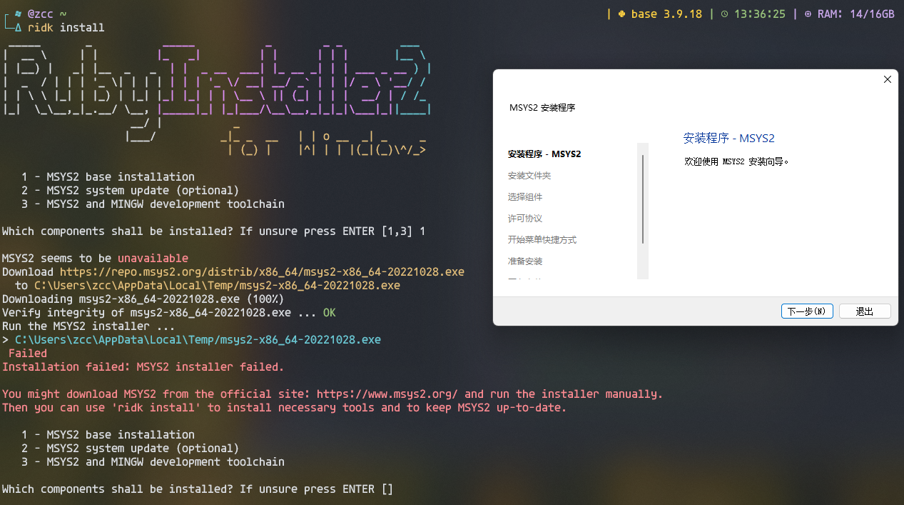
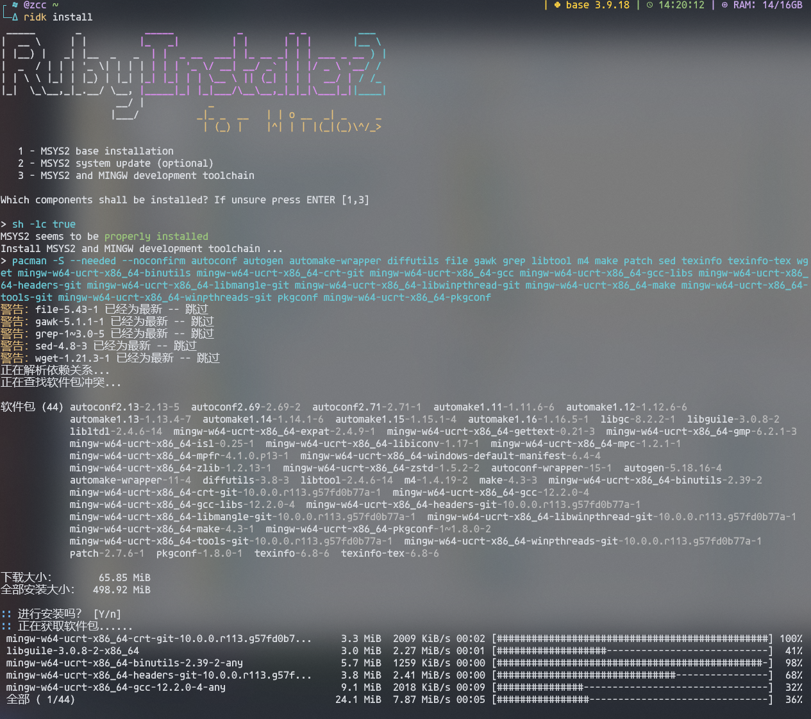
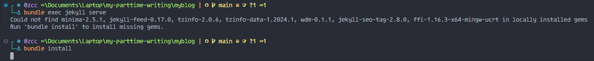

# My Part-time writing

---
[toc]

## Post with Jekyll

Step 0. Before everything, you need to write the articles, and you need the RubyGems to run the jekyll.
<https://www.ruby-lang.org/en/documentation/installation/>

Step 1. Start the Jekyll project

```powershell
# Install the jekyll and bundler gems
gem install bundler jekyll

# Create a new Jekyll site at ./myblog
jekyll new myblog

# Change into your new directory
cd myblog

# Fit the project, see Step 2

# Build the site and make it available on a local server.
bundle exec jekyll serve
```

Step 2. Fit the project
It tells the Jekyll where to place your posts.
The posts are the html files inside the [./myblog/_site/full-content/](./myblog/_site/full-content/) folder.

```yml
# --------------------
# Add the following to the myblog/_config.yml
permalink: /full-content/:year-:month-:day-:title
```

Step 3. Run the [./python/app.py](./python/app.py) to update your articles inside [./article](./article) folder.
The jekyll will **automatically** update the [./myblog/_site](./myblog/_site) folder since the [_posts](./myblog/_posts) is changed by the app.
Moreover, the app also copies the folders with the images into the [./myblog/_site/full-content/](./myblog/_site/full-content/) folder, where the posted articles are stored as html.

```powershell
python python/app.py
```

## Ruby installation

- The gem needs new sources, <https://mirrors.tuna.tsinghua.edu.cn/help/rubygems/>

```powershell
# Update gem sources
# 添加镜像源并移除默认源
gem sources --add https://mirrors.tuna.tsinghua.edu.cn/rubygems/ --remove https://rubygems.org/
# 列出已有源
gem sources -l
# 应该只有镜像源一个
# https://mirrors.tuna.tsinghua.edu.cn/rubygems/

# Update bundle sources
bundle config mirror.https://rubygems.org https://mirrors.tuna.tsinghua.edu.cn/rubygems
```

- Install jekyll

```powershell
# Option -V toggles the debug verbose
gem install bundler kekyll -V
```

- The jekyll needs msys2 support, and the msys2 needs its toolchain.
Here is how to install them.

<div style="display: flex">
    </img>
    </img>
</div>

- The bundle needs its gems(dependencies)

```powershell
# Cd to the blog's directory
cd myblog
# Install the gems
bundle install
```


